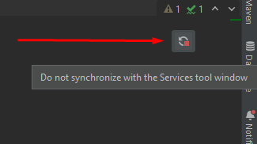
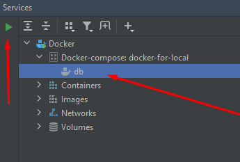
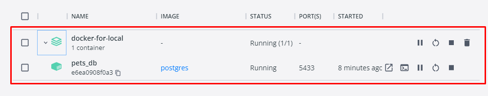
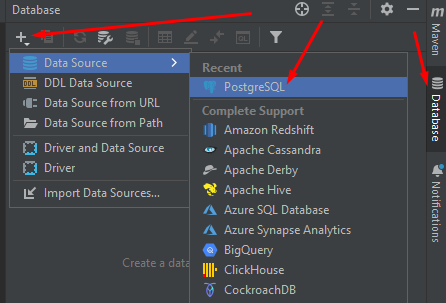
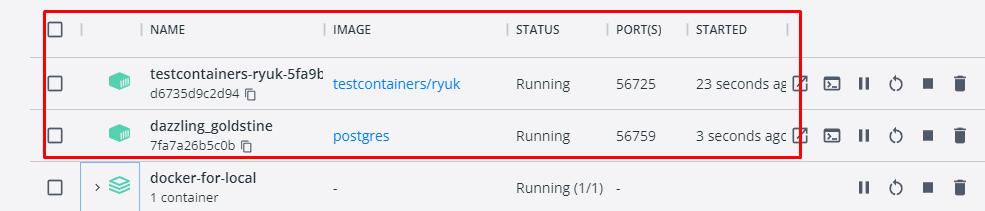

# Скачивание проекта

Для загрузки проекта необходимо зарегистрироваться 
по инвайт-ссылке на [ресурсе](https://git.kata.academy/) 

1. После регистрации и получения доступа к проекту,
на главной странице на вкладке **Your projects** 
должен появиться проект _Pet_clinic._
2. Заходим на страницу проекта и клонируем ссылку на проект
3. Переходим в свою IDE и создаем новый VC проект. Для этого переходим в **File -> New -> Project for Version Control**.
Либо на стартовой странице нажимаем на кнопку **Get from VCS**.
4. По требованию вводим свой логин и пароль который вводили при регистрации
на **git.kata.academy**. 


# Установка Docker и запуск контейнера БД.

Для того что бы запустить проект нам потребуется приложение Docker. 

1. Загружаем версию для вашей ОС по [ссылке](https://docs.docker.com/get-docker/) и после установки перезагружаем ПК. 
2. Соглашаемся с лицензионным соглашением и запускаем Docker Desktop 
(может потребоваться установка пакета обновления ядра Linux.Качаем и устанавлиавем по
[ссылке](https://docs.microsoft.com/ru-ru/windows/wsl/install-manual#step-4---download-the-linux-kernel-update-package))
3. После установки обновления должно появиться приветственное окно Docker Desktop, где можно пройти обучение по работе с контейнером
запустив тестовый контейнер (не обязательно)
4. После того как Docker успешно запустился переходим в IDE во вкладку **Services** и нажимаем **Add service -> Docker connection.**
В появившемся окне оставляем настройки по умолчанию , жмем **ОК**. 
5. Переходим в проекте по пути **/docker-for-local** и открываем **docker-compose.yml.** Нажимаем **Synchronize with the Services tool window**



7. После этого во вкладке Services в Docker должна появиться новая конфигурация **Docker-compose: docker-for-local;** 



Запускаем контейнер. Docker загрузит необходимые файлы и запустит нашу БД. 
8. Если всё сделано правильно то после запуска контейнера в **Docker Desktop** должен отобразиться
наш контейнер со статусом **Running** и можно будет подключиться к нашей БД из IDE. 



Для этого переходим во вкладку **Database** нажимаем **New -> Database -> PostgreSQL**



9. Идем по пути **/pet_clinic/web/src/main/resources/application-local.properties**, здесь берем настройки для подключения к БД. 


# Выбор профиля и запуск приложения.
Для того что бы запустить приложение необходимо выбрать конфигурацию запуска. Для этого:
1. Находим в древе проекта **PetClinicApplication** по пути  **/pet_clinic/web/src/main/java** правой кнопкой мыши
вызываем выпадающее меню и проходим по пути **More Run/Debug -> Modify Run Configuration**
2. В VM Options добавляем ```-ea -Dspring.profiles.active=local``` либо в поле "Active profiles" пишем имя профиля "local".
3. Нажимаем **Apply** и **OK** 
4. Если все сделано правильно можно запускать наше приложение. Что бы убедиться что приложение успешно запустилось можно перейти по [ссылке](http://localhost:8080/swagger-ui.html) и проверить работу Swager'а.

# Запуск локальных тестов

Для запуска локальных тестов необходимо активировать профиль test при запуске тестов. 
Для этого:

1. Вызываем выпадающее меню и проходим по пути **More Run/Debug -> Modify Run Configuration**
2. В VM Options добавляем ```-ea -Dspring.profiles.active=test```
3. Нажимаем **Apply** и **OK**
4. Если все сделано правильно при старте тестов должен запуститься тестовый контейнер, это можно увидеть в Docker Desktop. После прохождения тестов контейнер удалится. 

